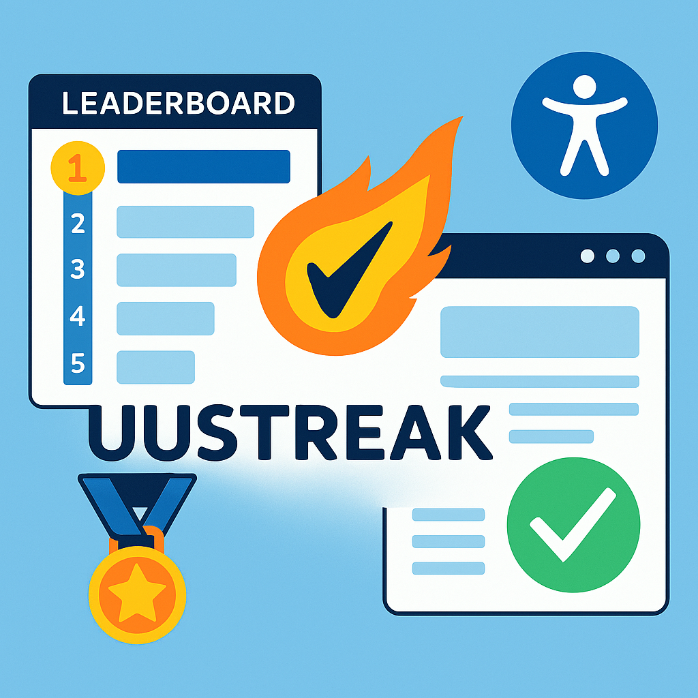

# Spillifisering av statusmålinger

Tilsynet for universell utforming av ikt (uutilsynet) utførte ["statusmålinger" av norske nettsider i 2014, 2015, 2017 og 2018](https://www.uutilsynet.no/statusmalingar/digitale-barrierar-avdekka-i-statusmalingar/1179) men har ikke utført noen flere statusmålinger etter dette.

Dette prosjektet har som mål å utføre en statusmåling av norske nettsider med automatisk testing og "[spillifisere](https://no.wikipedia.org/wiki/Spillifisering)" det å ha en nettside uten WCAG-brudd ved å lage en "highscore"-liste som oppdateres jevnlig med "streak"-score på antall dager uten WCAG-brudd.

Prosjektet bruker i utgangspunktet listen fra 2018 med 278 nettsider i privat og offentleg sektor, men vil utvides med flere store norske nettsider fremover.

Løsningen kjører Playwright med AXE på GitHub Actions.

Alle testene genereres fra scratch hver gang med [generate_specs.py](https://github.com/turbolego/uustreak/blob/main/generate_specs.py) fra listen med nettsider i [projects.json](https://github.com/turbolego/uustreak/blob/main/projects.json) slik at man alltid tester likt. Testene kjøres med incognito modus med chromium med firefox og webkit som fallbacks.

Lansert på ODIN konferansen i 2025 i forbindelse med presentasjonen ["Levende Tilgjengelighetserklæring"](https://event.dataforeningen.no/odin2025/program/) med [Tobias Müller Andersen](https://www.linkedin.com/in/turbolego/) og [Lilly Arstad Helmersen](https://www.linkedin.com/in/lillyahelmersen/)

## Achievement tracker

[Achievement tracker](js/track-achievements.js) updates achievements in
[projects.json](projects.json). "Nobody's Perfect" is awarded when a streak of at
least 365 days ends with a violation report. For example:

```json
{
  "type": "nobodys_perfect",
  "fromDate": "2025-09-18",
  "toDate": "2026-09-30",
  "lostDate": "2026-10-01",
  "lostReason": "Page content: 2 violations found: Elements must meet minimum color contrast ratio thresholds (2)",
  "unlockedDate": "2026-10-02",
  "streakDays": 378
}
```

`lostReason` summarizes the latest report on `lostDate`: whether the violations
come from embedded code, page content, or both; the total violation count; and up
to three rule descriptions, with counts and a remaining-rule count when needed.
Embedded code is detected from common consent/CMP vendor markers (including
OneTrust) and embedded element evidence such as scripts, iframes, and embeds.
The achievement dialog displays the result alongside the loss date. Existing
achievements without a reason are backfilled on the next tracker run.

Run `node js/track-achievements.js` with the historical streak index or report
list available. Reports are read locally when present; set `SITE_BASE_URL` to the
published site's URL to fetch missing loss-date reports, as the scheduled
workflow does. If a report cannot be read, the tracker logs a warning and leaves
`lostReason` null (or unchanged for an existing achievement) so a later run can
retry without inventing a reason.

Run the focused regression tests with `node --test js/track-achievements.test.js`.

# Nettsider endret eller fjernet fra listen

Listen med de 278 nettsidene fra statusmålingen til uutilsynet i 2018 er brukt som utgangspunkt, men jeg har endret noen av disse:

* "Skedsmo kommune" ble slått sammen med "Lillestrøm kommune" i 2020, test utføres på "Lillestrøm kommune" sin nettside.
* "Norges Statsbaner AS" endret til "Vygruppen AS" pga. navneenndringen i 2019
* "Nemi Forsikring AS" slått sammen med "Storebrand ASA" pga. sammenslåingen i 2020
* "Carlsen Fritzøe Handel AS" slått sammen med "Byggmakker" pga. sammenslåingen i 2020
* "Stamina Trening AS" slått sammen med "Family Sports Club AS" pga. sammenslåingen i 2019
* "Direktoratet for forvaltning og ikt" slått sammen med "Digitaliseringsdirektoratet" pga. sammenslåingen i 2020
* "Get AS" slått sammen med "Telia Norge AS" pga. sammenslåingen i 2020
* "Hafslund Nett AS" slått sammen med "Elvia AS" pga. sammenslåingen i 2020
* "Hamar Media AS" fikk nytt navn "KildeGruppen AS" i 2023
* "Helgeland Sparebank" slått sammen med "Sparebank 1 DA" pga. sammenslåingen i 2021
* "Sparebanken Sogn og Fjordane" slått sammen med "Sparebank 1 DA" pga. sammenslåingen i 2023
* "Sparebanken Sør" slått sammen med "Sparebank 1 DA" pga. sammenslåingen i 2024
* "Sørlandsruta AS" endret til "Connect Bus AS" pga. sammenslåingen i 2022
* "Vest-Agder fylkeskommune" slått sammen med "Agder fylkeskommune" pga. sammenslåingen i 2020
* "Ski kommune" endret til "Nordre Follo kommune" pga. sammenslåingen i 2020
* privat-omsorg.no er lagt ned og erstattet med bpa-nord.no
* bergenclinics.no slått sammen med helse-bergen.no - [Bergensklinikkene er historie – Helse Bergen overtar](https://www.rusfeltet.no/arkiv/bergensklinikkene-er-historie-helse-bergen-overtar)
* Nettsidene for Alta Ungdomsskole ble flyttet fra alta.ungdomsskole.no til underside av alta.kommune.no


